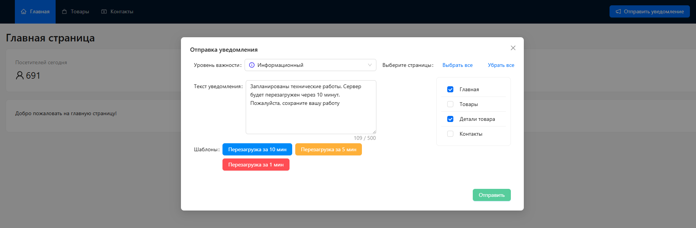
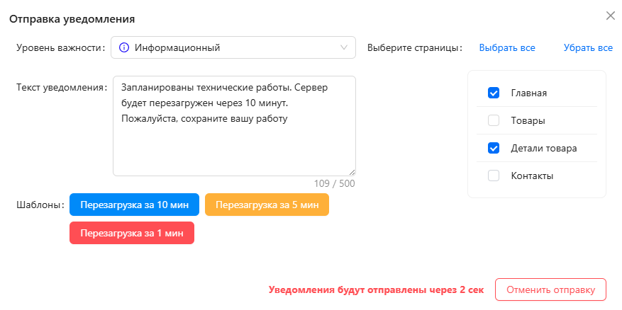
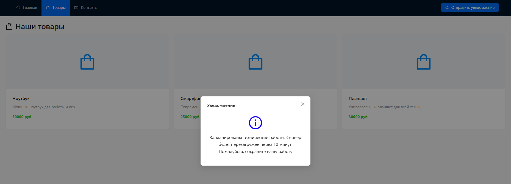

# Приложение с несколькими страницами, с возможностью отправить уведомления из админки на выбранные страницы
Использует вебсокет для рассылки уведомлений на выбранные из админки страницы

## Функционал:
- Через админку (кнопку отправить уведомления) можно выбрать страницы, на которые хотим отправить уведомления. Вводим текст уведомления и выбираем важность. Отправляем
- Отправка уведомлений с возможностью отменить отправку в течении 5 секунд (если передумали или допустили ошибку)
- Возможность выбрать разную важность уведомлений, что отобразитьс в уведомляющем окне в виде иконок разного цвета
- Предложено несколько шаблонов уведомлений для типичных ситуаций

## Требуется доработать:
- Авторизацию, поскольку кнопку отправки уведомлений должны видеть только администраторы
- После добавления функционала авторизации можно добавить трэкинг (отслеживание кто и когда на какую страницу перешел и когда вышел) для дальнейшего сбора данных и формирования статистики
- Можно добавить провайдер стора

## Стек:
- CSS modules
- Ant Design
- React
- TypeScript
- NodeJs (Express)
- WebSocket (SocketIO)

## Установка:
В корне проекта, в папке client и папке server 
***npm install*** - установка необходимых пакетов
Толькко в корне проекта
***npm run dev*** - запуск проекта

#Общий вид

#Процесс отправки

#Уведомления
